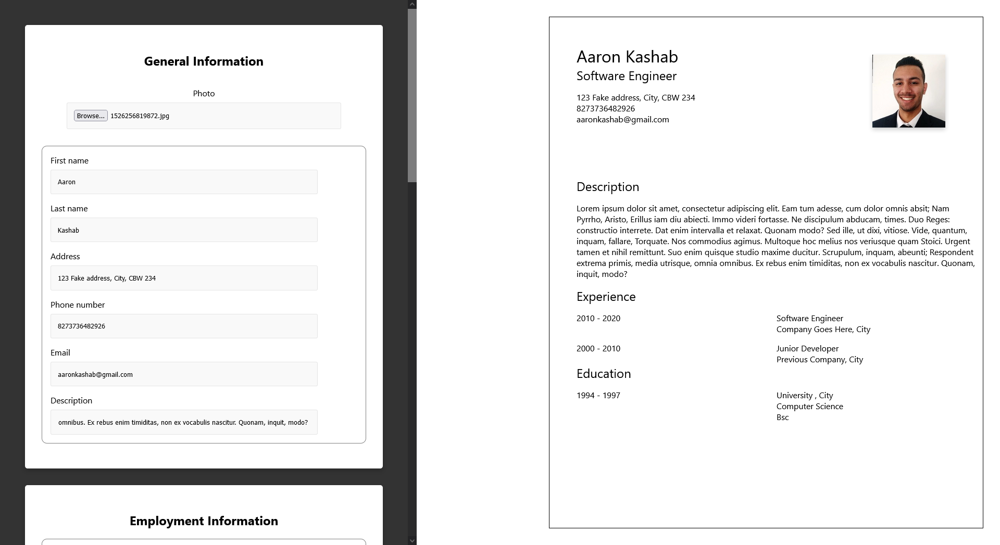

# Project: React CV Application

# What is this about?

A React based app which allows users to create their own CV.

This toy project is to enforce my learnings on React fundamentals (components and states management) as per https://theodinproject.com
The design of the project is to showcase the understanding of concepts below:

- ReactJS
- State management
- CSS
- HTML